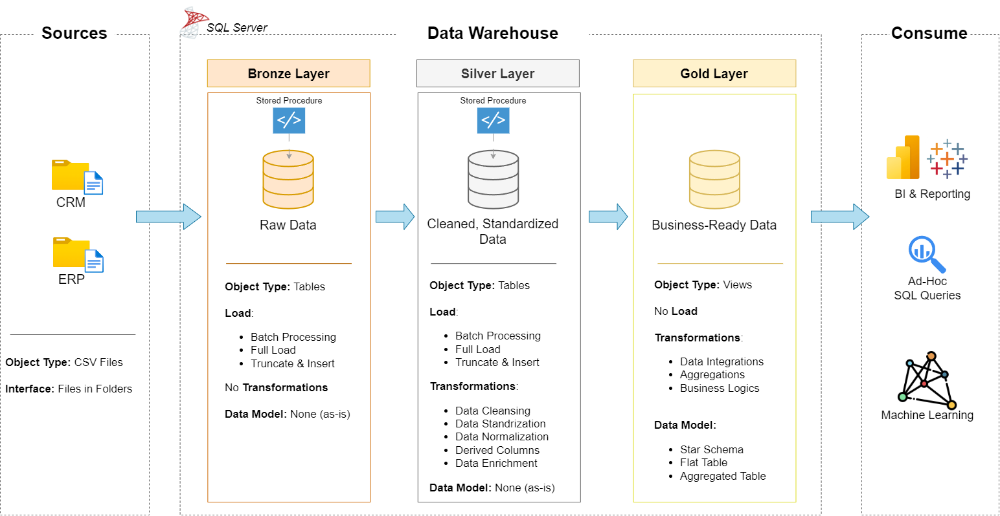

# Proyek Data Warehouse dan Analitik

Selamat datang di repositori **Data Warehouse and Analytics Project**! 🚀  
Proyek ini mendemonstrasikan solusi lengkap untuk data warehousing dan analitik — mulai dari membangun gudang data hingga menghasilkan insight yang dapat ditindaklanjuti. Dirancang sebagai proyek portofolio, proyek ini menampilkan praktik terbaik industri dalam data engineering dan analitik.

---

## 🏗️ Arsitektur Data

Arsitektur data proyek ini mengikuti pendekatan Medallion Architecture dengan tiga lapisan: **Bronze**, **Silver**, dan **Gold**.

1. **Bronze Layer**: Menyimpan data mentah langsung dari sistem sumber. Data diambil dari file CSV dan dimasukkan ke dalam SQL Server Database.
2. **Silver Layer**: Lapisan ini mencakup proses pembersihan data (cleansing), standarisasi, dan normalisasi sebelum dianalisis.
3. **Gold Layer**: Menyimpan data yang siap pakai secara bisnis, dimodelkan dalam bentuk *star schema* untuk keperluan pelaporan dan analisis.

---

## 📖 Ringkasan Proyek

Proyek ini mencakup:

1. **Arsitektur Data**: Mendesain data warehouse modern menggunakan Medallion Architecture (**Bronze**, **Silver**, **Gold**).
2. **ETL Pipelines**: Proses ekstraksi, transformasi, dan pemuatan data dari sistem sumber ke dalam warehouse.
3. **Pemodelan Data**: Mengembangkan tabel fakta dan dimensi yang dioptimalkan untuk kueri analitik.
4. **Analitik & Pelaporan**: Membangun laporan dan dasbor berbasis SQL untuk menghasilkan insight yang dapat ditindaklanjuti.

🎯 Repositori ini sangat bermanfaat untuk profesional dan mahasiswa yang ingin menampilkan keahlian dalam:
- Pengembangan SQL
- Arsitektur Data
- Data Engineering  
- Pengembangan Pipeline ETL  
- Pemodelan Data  
- Analitik Data  

---

## 🛠️ Tautan & Alat Penting

Semua sumber daya GRATIS!
- **[Datasets](datasets/):** Akses ke dataset proyek (file CSV).
- **[SQL Server Express](https://www.microsoft.com/en-us/sql-server/sql-server-downloads):** Server ringan untuk menjalankan database SQL.
- **[SQL Server Management Studio (SSMS)](https://learn.microsoft.com/en-us/sql/ssms/download-sql-server-management-studio-ssms?view=sql-server-ver16):** Antarmuka GUI untuk mengelola database.
- **[Git Repository](https://github.com/):** Gunakan GitHub untuk menyimpan, versi, dan kolaborasi kode.
- **[DrawIO](https://www.drawio.com/):** Mendesain arsitektur data, model, alur ETL, dan diagram lainnya.
- **[Notion Template](https://www.notion.com/templates/sql-data-warehouse-project):** Template proyek di Notion.
- **[Langkah-Langkah Proyek di Notion](https://thankful-pangolin-2ca.notion.site/SQL-Data-Warehouse-Project-16ed041640ef80489667cfe2f380b269?pvs=4):** Daftar lengkap fase dan tugas proyek.

---

## 🚀 Kebutuhan Proyek

### Membangun Data Warehouse (Data Engineering)

#### Tujuan
Mengembangkan data warehouse modern menggunakan SQL Server untuk mengonsolidasikan data penjualan, sehingga dapat dilakukan pelaporan dan pengambilan keputusan berbasis data.

#### Spesifikasi
- **Sumber Data**: Data diimpor dari dua sistem sumber (ERP dan CRM) dalam bentuk file CSV.
- **Kualitas Data**: Melakukan pembersihan dan perbaikan kualitas data sebelum dianalisis.
- **Integrasi**: Menggabungkan kedua sumber menjadi satu model data yang mudah digunakan untuk keperluan analitik.
- **Ruang Lingkup**: Fokus pada dataset terbaru saja, tidak mencakup historisasi data.
- **Dokumentasi**: Menyediakan dokumentasi model data secara jelas untuk mendukung kebutuhan tim bisnis dan analitik.

---

### BI: Analitik & Pelaporan (Data Analysis)

#### Tujuan
Mengembangkan analitik berbasis SQL untuk memberikan insight yang mendalam terhadap:
- **Perilaku Pelanggan**
- **Performa Produk**
- **Tren Penjualan**

Insight ini bertujuan mendukung pengambilan keputusan strategis oleh pemangku kepentingan.

📄 Selengkapnya bisa dilihat di [docs/requirements.md](docs/requirements.md)

---

## 📂 Struktur Repositori

data-warehouse-project/
│
├── datasets/ # Dataset mentah yang digunakan (ERP dan CRM)
│
├── docs/ # Dokumentasi proyek dan arsitektur
│ ├── etl.drawio # Diagram ETL dengan berbagai metode dan teknik
│ ├── data_architecture.drawio # Diagram arsitektur proyek
│ ├── data_catalog.md # Katalog dataset dan deskripsi field
│ ├── data_flow.drawio # Diagram alur data
│ ├── data_models.drawio # Diagram pemodelan data (star schema)
│ ├── naming-conventions.md # Panduan penamaan untuk tabel, kolom, dan file
│
├── scripts/ # Skrip SQL untuk ETL dan transformasi
│ ├── bronze/ # Skrip ekstraksi dan pemuatan data mentah
│ ├── silver/ # Skrip pembersihan dan transformasi
│ ├── gold/ # Skrip untuk model analitik
│
├── tests/ # Skrip pengujian dan file validasi kualitas data
│
├── README.md # Ringkasan dan petunjuk proyek
├── LICENSE # Informasi lisensi repositori
├── .gitignore # File dan folder yang diabaikan Git
└── requirements.txt # Dependensi yang dibutuhkan proyek
